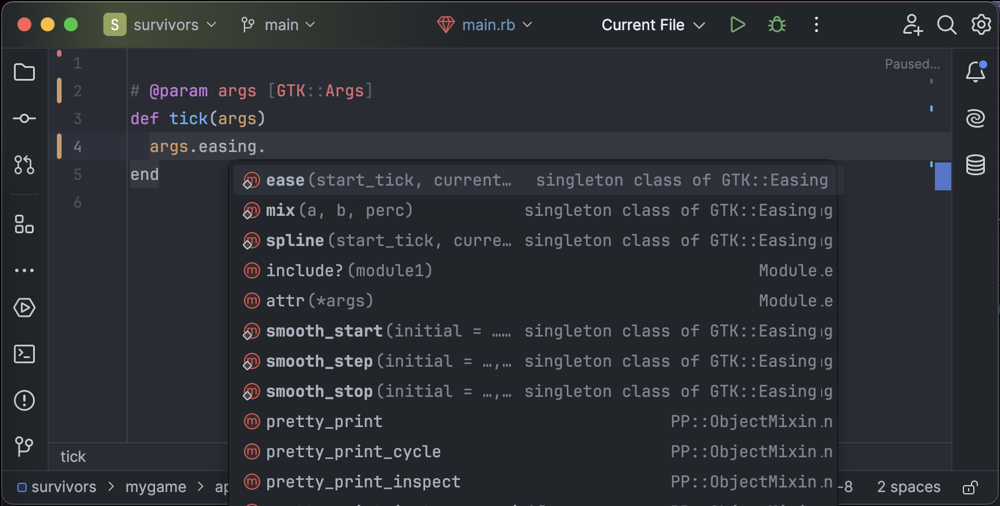
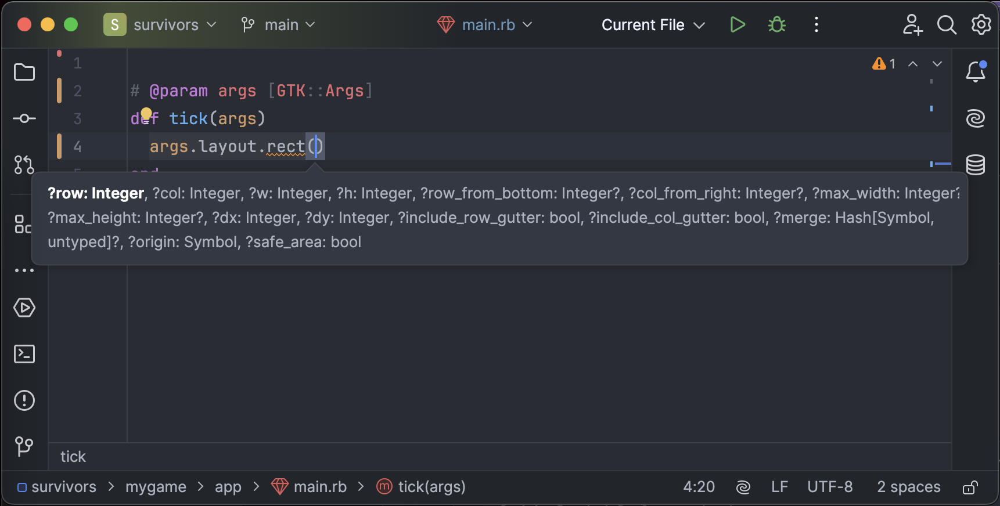
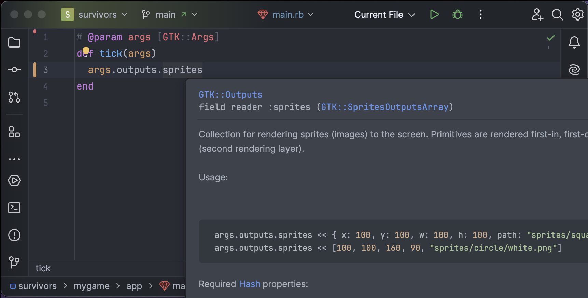
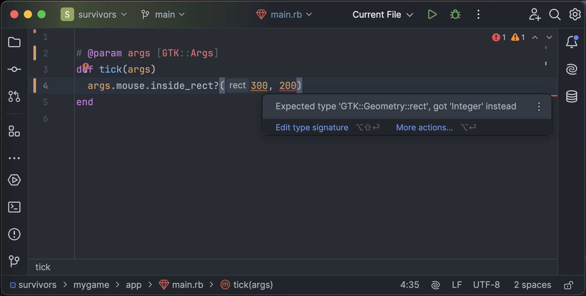

# DragonRuby RBS types

This project aims to provide great development experience in RubyMine
for [DragonRuby Game Toolkit](https://dragonruby.org/).

* RBS type definitions for DragonRuby
* Ruby shims, with documentation
* Typesafe* wrapper to some of the DragonRuby API (WIP)

If this works in other editors/IDE, this is purely coincidental, but very nice!

**Important:** consider this project experimental (and containing bugs) until it will be battle tested in real life.

<table>
<tr>
<td></td>
<td></td>
</tr>
<tr>
<td></td>
<td></td>
</tr>
</table>

## Usage

Add types as a Git submodule to your project files:

```shell
git submodule add https://github.com/FylmTM/dr-types.git mygame/.dr-types
```

**Important:** Make sure to mark `docs` and `samples` from DragonRuby as excluded sources in RubyMine.
Otherwise source that is shipped with DragonRuby itself will conflict with Ruby shims in this project.

RubyMine should automatically pick up types from now on.

**Update:**

```shell
git submodule update --remote mygame/.dr-types
```

### Main

Add `@param args [GTK::Args]` YARD annotation to your top-level lifecycle functions.

```ruby
# @param args [GTK::Args]
def tick(args) end

# @param args [GTK::Args]
def boot(args) end

# @param args [GTK::Args]
def reset(args) end

# @param args [GTK::Args]
def shutdown(args) end
```

### State

WIP.

### Typesafe wrapper

WIP.

## Background

Creation process looked roughly like this:

1. Initial stubs were generated with `rbs prototype` from `docs/oss`
2. Then they were heavily processed by LLM (Claude 3.7), to do a first pass (cross-referencing docs & code)
3. Then they were heavily manually tweaked by me, to make types sensible
4. Then I went through documentation fully, making sure that nothing is missing
5. Then LLM was used to generate Ruby shims from RBS types
6. Then LLM was used to add YARD documentation to generated Ruby shims
7. And one final review of generated Ruby code & documentation.

Types here might have functionality that is not documented explicitly, but was rather deduced based on
OSS code & samples.

Thanks to [owenbutler/dragonruby-yard-doc](https://github.com/owenbutler/dragonruby-yard-doc) for giving me hope.

## TODO

[ ] Improve: Outputs::primitives
[ ] Improve: Outputs::debug
[ ] Improve: Outputs::solids
[ ] Improve: Outputs::borders
[ ] Improve: Outputs::sprites
[ ] Improve: Outputs::lines
[ ] Improve: Outputs::labels
[ ] Improve: Outputs::[] (render targets)
[ ] Improve: Outputs::screenshots
[ ] Improve: Outputs::shaders
[ ] Improve: State & Entities
[ ] Support: macro - attr
[ ] Support: macro - attr_sprite
[ ] Support: macro - attr_gtk
[ ] Implement: Typesafe proxy - Outputs
[ ] Implement: Typesafe proxy - Audio
